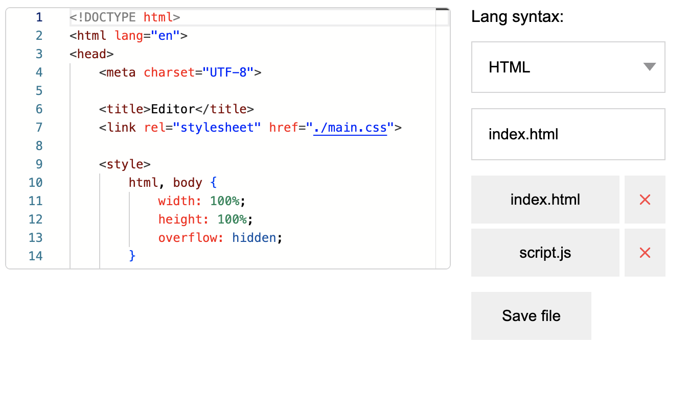

# Text editor using Kotlin/wasm and Monaco Editor

Simple text editor using Monaco Editor and Kotlin/wasm. 

Monaco Editor gives us cool text editing features like syntax highlighting and auto-completion, while Kotlin/wasm lets us run Kotlin code right in web browsers. 



## How to run

### Using docker-compose:
```shell
docker compose up
```
Front-end should appear on [localhost:8080](http://localhost:8080)

or

### Running front- and back-end independently:
```shell
docker run --name some-postgres -p 5432:5432 -e POSTGRES_PASSWORD=mysecretpassword -d postgres
```

```shell
POSTGRES_HOSTNAME=localhost \
POSTGRES_USER=postgres \
POSTGRES_PASSWORD=mysecretpassword \
POSTGRES_DB=postgres \
POSTGRES_PORT=5432 \
./gradlew :editor-backend:run
```

```shell
./gradlew :editor-frontend:wasmJsRun
```

